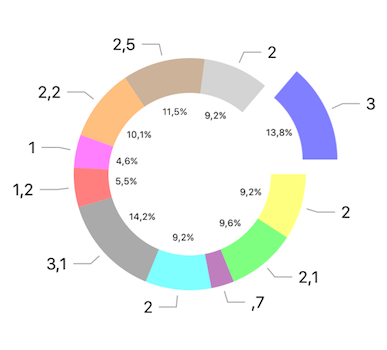
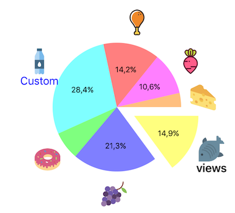
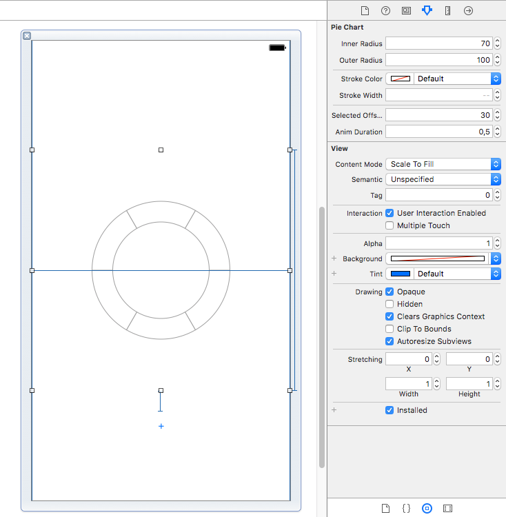

# PieCharts

[](http://cocoadocs.org/docsets/PieCharts)
[](https://github.com/Carthage/Carthage)
[](http://cocoadocs.org/docsets/PieCharts)

Easy to use and highly customizable pie charts library for iOS

Swift 4.2, iOS 8+

[Video](https://youtu.be/LPFTPMDKDAE)



## Features:
- Customizable slices
- Add overlays using simple UIViews
- Interactive
- Animated
- Dynamic slice insertion
- Reusable components via extensible layer system
- Configurable in interface builder
- [Legends](https://github.com/i-schuetz/ChartLegends). This is in a separate project to keep things focused and reusable.

## Installation

### CocoaPods

Add to your Podfile:

```ruby
use_frameworks!
pod 'PieCharts'
```

### Carthage

Add to your Cartfile:

```
github "i-schuetz/PieCharts"
```

## Usage

### Basic chart:

```swift
@IBOutlet weak var chartView: PieChart!

chartView.models = [
    PieSliceModel(value: 2.1, color: UIColor.yellow),
    PieSliceModel(value: 3, color: UIColor.blue),
    PieSliceModel(value: 1, color: UIColor.green)
]
```

Configurable in interface builder, with live update of the view:



### Overlays:

Overlays are implemented using layers. There are several built in layers and you also can implement your own ones. 

To add text e.g. text labels inside the slices + text with lines outside, simply:
```swift
chartView.layers = [PiePlainTextLayer(), PieLineTextLayer()]

```

Each layer has its own customization options. For example, here we customize the plain labels layer:

```swift
let textLayerSettings = PiePlainTextLayerSettings()
textLayerSettings.viewRadius = 55
textLayerSettings.hideOnOverflow = true
textLayerSettings.label.font = UIFont.systemFont(ofSize: 8)

let formatter = NumberFormatter()
formatter.maximumFractionDigits = 1
textLayerSettings.label.textGenerator = {slice in
    return formatter.string(from: slice.data.percentage * 100 as NSNumber).map{"\($0)%"} ?? ""
}

let textLayer = PiePlainTextLayer()
textLayer.animator = AlphaPieViewLayerAnimator()
textLayer.settings = textLayerSettings

```

This is the custom views layer, which makes possible to create custom views:
```swift
let viewLayer = PieCustomViewsLayer()

let settings = PieCustomViewsLayerSettings()
settings.viewRadius = 135
settings.hideOnOverflow = false
viewLayer.settings = settings

viewLayer.viewGenerator = {slice, center in
    let myView = UIView()
    // add images, animations, etc.
    return myView
}

```

### Interactivity, events:

Conform to `PieChartDelegate` to react to interaction and other events:

```swift
func onGenerateSlice(slice: PieSlice)
func onStartAnimation(slice: PieSlice)
func onEndAnimation(slice: PieSlice)
func onSelected(slice: PieSlice, selected: Bool)
```

### Dynamic slice insertion:

```swift
chartView.insertSlice(index: 1, model: PieSliceModel(value: 5, color: UIColor.blue))
```

## Contributing

1. Fork
2. Commit changes to a branch in your fork
3. Push your code and make a pull request

## Outlook

The layer system can be abstracted a step further in order to make the slices themselves be in a layer. This way we can combine multiple slice-layers to create more complex types of pie charts.

## Credits

The food images used in the demo are from freepik.com, and flaticon.com/authors/madebyoliver

## Created By:

Ivan Schütz

## License

SwiftCharts is Copyright (c) 2017 Ivan Schütz and released as open source under the attached [Apache 2.0 license](LICENSE).

THE SOFTWARE IS PROVIDED "AS IS", WITHOUT WARRANTY OF ANY KIND,  
EXPRESS OR IMPLIED, INCLUDING BUT NOT LIMITED TO THE WARRANTIES OF  
MERCHANTABILITY, FITNESS FOR A PARTICULAR PURPOSE AND NONINFRINGEMENT.  
IN NO EVENT SHALL THE AUTHORS BE LIABLE FOR ANY CLAIM, DAMAGES OR  
OTHER LIABILITY, WHETHER IN AN ACTION OF CONTRACT, TORT OR OTHERWISE,  
ARISING FROM, OUT OF OR IN CONNECTION WITH THE SOFTWARE OR THE USE OR  
OTHER DEALINGS IN THE SOFTWARE.

